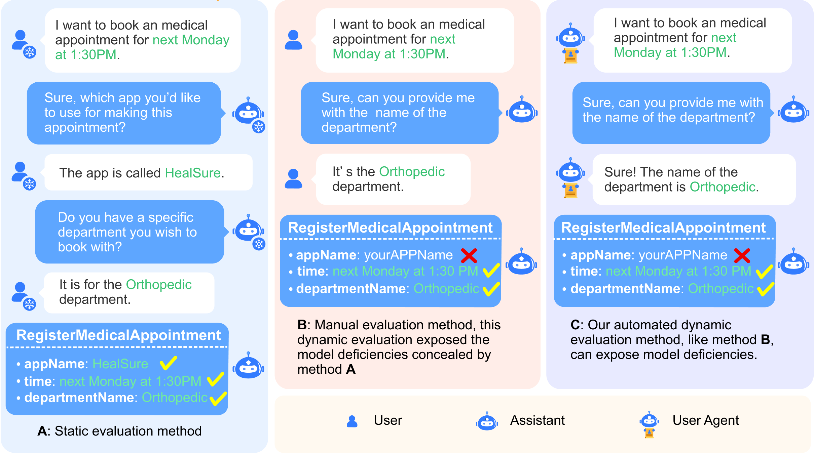

# Automatic Dynamic Evaluation (**AutoDE**)

Automatic Dynamic Evaluation (AutoDE) is an innovative framework designed to assess the API invocation capabilities of AI assistants through dynamic interactions. This system aims to simulate real user-to-AI assistant conversations to more accurately evaluate the performance of AI assistants, especially in dynamic and real-time interactive environments.



# Prerequisites

Before you run the evaluation, ensure that all necessary dependencies are installed in your environment.

```
pip install -r requirements.txt
```

# Evaluation

This repository offers a variety of evaluation methods. Below are the available evaluation scripts and their corresponding actions, please check `scripts` directory for available values for `<user_agent>` and `<assistant>`.

- **Automatic Dynamic Evaluation** (**AutoDE**) (see Section 3.1.3):
```
bash scripts/u_<user_agent>_a_<assistant>.sh
```
- **Static Evaluation** (see Section 3.1.2):
```
bash scripts/a_<assistant>_static.sh
```
- **Manual Evaluation** (see Section 3.1.1):
```
bash scripts/a_<assistant>_human.sh
```
- **User Script Generation** (see Section 3.2.2):
```
python -m crawlers/crawl_profiles.py
``` 
- **Static Dialogue History Generation** (see Section 3.2.3):
```
python -m crawlers/crawl_eng.py
```
also check `utils/parse_records.py`

# Data
- **APIs Documentation** (see Section 3.2.1): `API_list.xlsx`
- **User Scripts** (see Section 3.2.2): `results/dialogue_profiles_v2_2_uuid.txt`
- **Static Dialogue History & Corrected Label** (see Section 3.2.2 and Section 3.2.3): `datasets/data_v1_2.jsonl`
- **Manual Evaluation Data**: `results/a_<assistant>_human.jsonl`
- **Static Evaluation Data**: `results/a_<assistant>_static.jsonl`
- **Automatic Dynamic Evaluation Data**: `results/u_<user_agent>_a_<assistant>.jsonl`

# Additional Resources
Please also check `PROMPTS_AT_GLANCE.md` for prompts used in the experiments and `HUMAN_ANNOTATION_MANUAL.md` for human annotation instructions.

# Citation

Feel free to cite the repo if you think AutoDE is useful.

```
@misc{mu2024static,
      title={Beyond Static Evaluation: A Dynamic Approach to Assessing AI Assistants' API Invocation Capabilities}, 
      author={Honglin Mu and Yang Xu and Yunlong Feng and Xiaofeng Han and Yitong Li and Yutai Hou and Wanxiang Che},
      year={2024},
      eprint={2403.11128},
      archivePrefix={arXiv},
      primaryClass={cs.CL}
}
```
